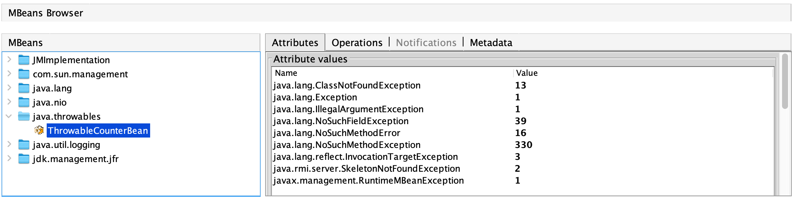

# Exception Count Metrics Java Agent

Java agent that collects created exception count, collects metrics of instantiated exception counts by exception type. Captures all throwable creation events, including JVM errors, unlogged and unthrown exceptions. 
Useful for monitoring application health in java applications that do not expose sufficient logging configuration capabilities or frameworks that do not capture certain types of errors (e.g. RxJava 2).

## usage example

In order to collect exception count JMX metrics, attach javaagent (from releases section) to java application:

```bash
-javaagent:/path/to/javaagent.jar
```

After javaagent is attached `ThrowableCounterBean` JMX bean will appear in `java.throwables` package that exposes exception creation metrics:

